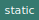

# Module `templates/markdown/publish`


Defines a JSDoc template that creates a code tree based on the JSDoc doclets
and calls the docgenerator.

[Source file](..\templates\markdown\publish.js)

## Functions

### `publish(data, options)`

 

Builds a tree of JSDoc doclet data and generates documentation.

Parameters | Type | Description
--- | --- | ---
__data__ | `Salty` | *The database containing comments and tags.*
__options__ | `Object` | *The JSDoc options.*

---

### `attachToParent(doclet, parentNode, doclets)`


Attaches the given JSDoc doclet to the given parent node.

Parameters | Type | Description
--- | --- | ---
__doclet__ | `Doclet` | *The JSDoc doclet to attach.*
__parentNode__ | `Doclet` | *The parent node on which to attach the JSDoc doclet.*
__doclets__ | `Array.<Doclet>` | *The array of all JSDoc doclets.*

---

### `buildTree(parentNode, doclets, parentLongname)`


Builds the documentation tree recursively.

Parameters | Type | Description
--- | --- | ---
__parentNode__ | `Doclet` | *The parent node.*
__doclets__ | `Array.<Doclet>` | *The array of all JSDoc doclets.*
__parentLongname__ | `string` | *The JSDoc long name of the parent.*

---

## Constants

### `configuration`


Configuration used to build the documentation tree.
Each key is a JSDoc doclet kind, expliciting the children collection name that will be created
and if a recursive parsing is required to build this collection.

#### Value

```javascript
{
  namespace: { childrenCollection: 'namespaces', recurse: true },
  module: { childrenCollection: 'modules', recurse: true },
  class: { childrenCollection: 'classes', recurse: true },
  mixin: { childrenCollection: 'mixins', recurse: true },
  function: { childrenCollection: 'functions', recurse: false },
  member: { childrenCollection: 'members', recurse: false },
  event: { childrenCollection: 'events', recurse: false },
  constant: { childrenCollection: 'constants', recurse: false }
}
```

---
